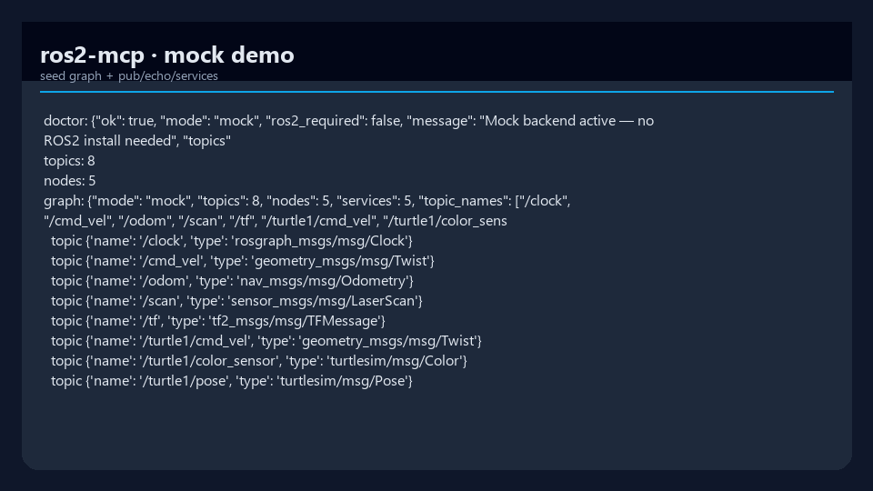
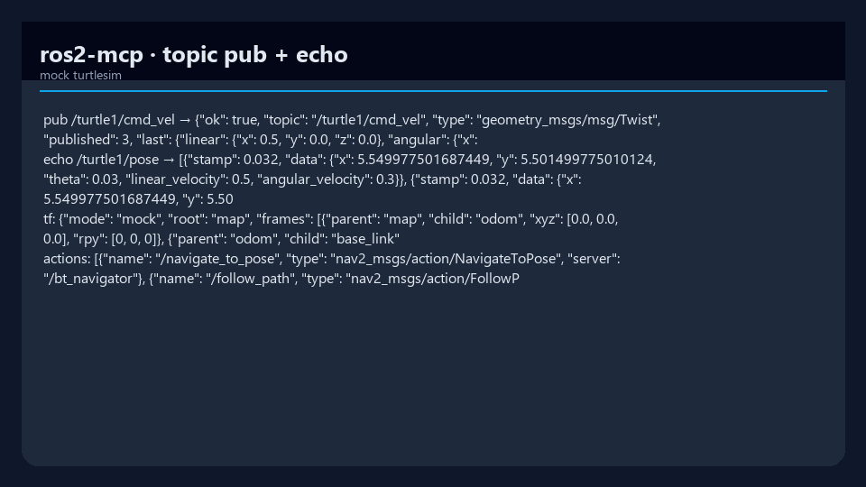

# ros2-mcp

[](https://www.python.org/downloads/)
[](pyproject.toml)
[](LICENSE)
[](https://modelcontextprotocol.io)
[](https://github.com/mergeos-bounties)

**ros2-mcp** is an [MCP (Model Context Protocol)](https://modelcontextprotocol.io) server so AI agents (Grok, Cursor, Claude, …) can **inspect and control ROS2** graphs — topics, nodes, services, TF, actions — without hand-writing every `ros2` CLI call.

Product: [mergeos-bounties/ros2-mcp](https://github.com/mergeos-bounties/ros2-mcp)

---

## Table of contents

- [Modes](#modes)
- [Highlights](#highlights)
- [Screenshots](#screenshots)
- [Quick start](#quick-start)
- [CLI reference](#cli-reference)
- [MCP host config](#mcp-host-config)
- [Diagrams](#diagrams)
- [Architecture](#architecture)
- [Development](#development)
- [MergeOS bounties](#mergeos-bounties)
- [License](#license)

---

## Modes

| Mode | When | Behavior |
| --- | --- | --- |
| **mock** (default) | Windows / CI / no ROS2 install | Seeded turtlesim-like graph: topics, pub, echo, services, TF, actions |
| **live** | Host has ROS2 + CLI | Real graph via `ros2` subprocess bridge (secrets redacted in logs) |

---

## Highlights

| Capability | Description |
| --- | --- |
| **Offline demo** | `ros2-mcp demo` exercises doctor, topics, pub/echo, spawn, TF, actions |
| **MCP stdio serve** | Plug into agent hosts as an MCP server |
| **One-shot call** | `ros2-mcp call` without a full MCP host |
| **Tool list** | Discover registered MCP tools |
| **Lappa-friendly** | Complements [Lappa](https://github.com/mergeos-bounties/Lappa) package IDE workflows |

---

## Screenshots

| Mock graph | Pub + echo |
| :---: | :---: |
|  |  |
| *Seeded graph / doctor* | *cmd_vel pub + pose echo* |

---

## Quick start

```powershell
cd ros2-mcp
python -m venv .venv
.\.venv\Scripts\activate
pip install -e ".[dev]"

ros2-mcp version
ros2-mcp demo
ros2-mcp tools list
```

Mock mode needs **no** ROS2 install.

---

## CLI reference

| Command | Purpose |
| --- | --- |
| `ros2-mcp version` | Version + mode |
| `ros2-mcp demo` | Offline smoke of core backend APIs |
| `ros2-mcp serve` | MCP server over **stdio** (for hosts) |
| `ros2-mcp call …` | One-shot tool call (mock/live) |
| `ros2-mcp tools list` | List MCP tools |

```powershell
# MCP for Cursor / Claude / Grok-compatible hosts
ros2-mcp serve
```

---

## MCP host config

Example stdio server entry (adjust path to your venv):

```json
{
  "mcpServers": {
    "ros2-mcp": {
      "command": "ros2-mcp",
      "args": ["serve"],
      "env": {
        "ROS2_MCP_MODE": "mock"
      }
    }
  }
}
```

Set `ROS2_MCP_MODE=live` only on machines with a working ROS2 environment.

---


## Diagrams

Interactive Archify diagrams (dark/light theme, export PNG/SVG in the HTML viewer):

| Diagram | Interactive | README embed |
| --- | --- | --- |
| **Architecture** | [docs/diagrams/architecture.html](docs/diagrams/architecture.html) |  |
| **Workflow** | [docs/diagrams/workflow.html](docs/diagrams/workflow.html) |  |

*Generated with [archify](https://github.com/tt-a1i) — open the `.html` files for theme toggle and export.*

## Architecture

```text
AI agent (MCP host)
        │ stdio
        ▼
   ros2-mcp server
        │
   ┌────┴────┐
   │ mock    │  seeded graph (CI / Windows)
   │ live    │  ros2 CLI subprocess bridge
   └─────────┘
```

```text
src/ros2_mcp/
  cli.py
  backend/     # mock + live backends
  server.py    # FastMCP tools
docs/screenshots/
```

---

## Development

```powershell
pytest -q
ruff check src tests
ros2-mcp demo
```

Live mode tests should mock subprocesses — CI must not require a ROS2 distro.

---

## MergeOS bounties

Tools for actions/TF, live parsers, Lappa HTTP bridge, publish allowlists.  
Star → claim → PR **master** → MRG **25–200**. Evidence: CLI logs / MCP host config snippets (redact secrets).

---

## Tiếng Việt

**ros2-mcp** cho AI điều khiển ROS2 qua MCP. Offline: `ros2-mcp demo` (mock). Live: máy có ROS2 + `ROS2_MCP_MODE=live`.

---

## License

MIT · MergeOS / ThanhTrucSolutions
